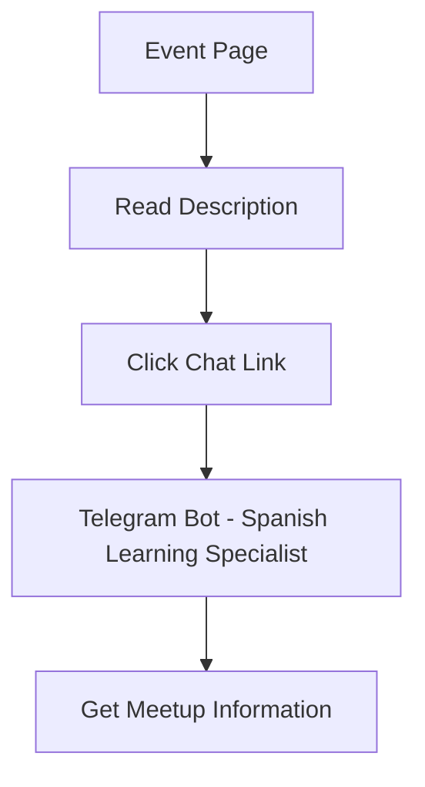

## 1. Product Overview
A simple one-page website for Spanish learning meetups that connects community members through an AI-powered chat assistant. Users can learn about upcoming Spanish language events and get immediate answers about the meetup through a specialized chatbot.

The product targets language learners and community organizers who want to facilitate Spanish conversation practice in a friendly, accessible way.

## 2. Core Features

### 2.1 User Roles
| Role | Registration Method | Core Permissions |
|------|---------------------|------------------|
| Visitor | No registration required | View event details, access chatbot |

### 2.2 Feature Module
Our Spanish learning meetup platform consists of a single main page:
1. **Event Page**: Event description, meetup details, and chat interaction link.

### 2.3 Page Details
| Page Name | Module Name | Feature description |
|-----------|-------------|---------------------|
| Event Page | Hero Section | Display engaging banner with "Spanish Language Meetup" title and welcoming imagery |
| Event Page | Event Description | Show detailed information about the Spanish learning meetup including date, time, location, and what to expect |
| Event Page | Chat Link | Prominent "Chat to know more" button that opens Telegram bot specialized for Spanish learning meetups |
| Event Page | Meetup Details | Include information about skill levels welcome, conversation topics, and group size |
| Event Page | Contact Info | Display organizer contact and location details for the meetup |

## 3. Core Process
**Visitor Flow**: Landing Page → Read Event Description → Click "Chat to know more" → Telegram Bot for Spanish Learning → Get questions answered about the meetup

## 4. User Interface Design

### 4.1 Design Style
- **Primary Colors**: Warm orange (#F97316) for Spanish culture theme, white for backgrounds
- **Secondary Colors**: Deep red (#DC2626) for accents, light yellow (#FEF3C7) for highlights
- **Button Style**: Rounded corners with "Chat to know more" in prominent orange
- **Typography**: Friendly sans-serif font (Inter), 18px base size for readability
- **Layout**: Single-page scroll design with clear sections and generous spacing
- **Icons**: Spanish-themed icons (speech bubbles, books, people) from Lucide React

### 4.2 Page Design Overview
| Page Name | Module Name | UI Elements |
|-----------|-------------|-------------|
| Event Page | Hero Section | Large "Spanish Language Meetup" title over warm gradient background, friendly group photo |
| Event Page | Description | Clean card layout with event details, bullet points for key information |
| Event Page | Chat Button | Large orange button with chat icon, fixed position for easy access |
| Event Page | Details Section | Icon-based info cards showing time, location, skill level, and topics |

### 4.3 Responsiveness
Desktop-first design with mobile optimization. Single column layout on mobile with larger touch targets, readable font sizes, and stacked information cards for easy scrolling.