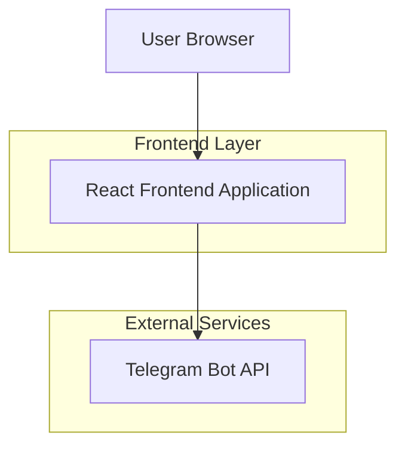

## 1. Architecture Design



## 2. Technology Description

- **Frontend**: React@18 + tailwindcss@3 + vite
- **Backend**: None (static site with Telegram bot integration)

## 3. Route Definitions

| Route | Purpose |
|-------|---------|
| / | Event page displaying Spanish learning meetup information |

## 4. Implementation Details

### 4.1 Telegram Bot Integration
The Telegram bot will be specialized for Spanish learning meetups and can answer questions about:
- Event details (date, time, location)
- Skill level requirements
- Conversation topics
- What to bring
- Group size and format
- Spanish language tips for beginners

### 4.2 Chat Link Implementation
```html
<a href="https://t.me/YourSpanishMeetupBot" 
   target="_blank" 
   class="chat-button">
   Chat to know more
</a>
```

### 4.3 Static Site Structure
```
src/
├── components/
│   ├── HeroSection.jsx
│   ├── EventDetails.jsx
│   ├── ChatButton.jsx
│   └── Footer.jsx
├── App.jsx
└── main.jsx
```

### 4.4 Deployment Options
- **Vercel**: Automatic deployments from Git
- **Netlify**: Drag-and-drop deployment
- **GitHub Pages**: Free hosting for static sites

The architecture is intentionally minimal - just a single React page that links to a Telegram bot specialized for Spanish learning meetups. No backend, database, or user authentication needed.